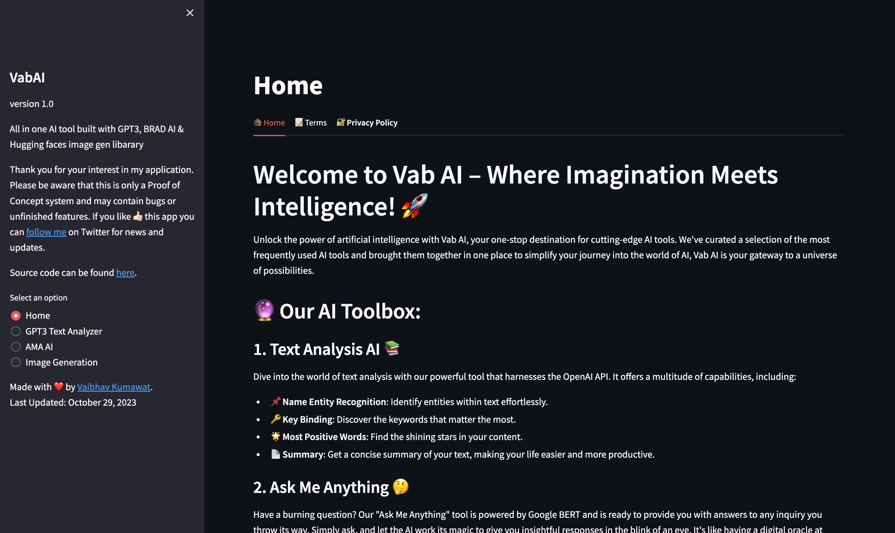

# **Vab-AI  🚀**

Vab AI is your all-in-one AI toolkit, bringing you cutting-edge AI tools at your fingertips. Picture a world where you can analyze text, get instant answers, and even generate stunning images with the power of AI. It's like having a digital oracle, a text wizard, and an image magician in one place! 📚🤖📷

<br><br>

[](https://github.com/vaibhavkumawat-17/Vab-AI/blob/main/README.md)

<br><br>

<div align="center">
<h1 align="center">

<p align="center">


</p>


</div>

## 📖 Table of Contents

- [📖 Table of Contents](#-table-of-contents)
- [📍 Overview](#-overview)
- [📦 Features](#-features)
- [📂 Repository Structure](#-repository-structure)
- [⚙️ Modules](#-modules)
- [📚 Object-Oriented Programming Concepts](#-object-oriented-programming-concepts)
- [How Does 💻 app.py Work?](#how-does-apppy-work)
- [🚀 Getting Started](#-getting-started)
  - [Prerequisites ✅](#-prerequisites-)
  - [Install Dependencies 📦](#-step-3-install-dependencies-)
  - [Run the Application 🚀](#-step-6-run-the-application-)
- [🤝 Contributing](#-contributing)
- [📄 License](#-license)
- [👏 Acknowledgments](#-acknowledgments)

---

## 📍 Overview

VabAI is an all-in-one AI-powered web application built with a range of cutting-edge technologies and services. It offers an array of features designed to empower users with the latest AI capabilities:

1. GPT-3 Text Analyzer 🔍: Unleash the power of GPT-3 for supercharged text analysis. Extract key insights, discover the most positive words, and visualize named entity recognition for your text.

2. AMA AI (Ask Me Anything) 🤖: Meet your virtual buddy, AMA AI. Ask questions and receive smart responses in the blink of an eye.

3. Image Generation 🖼️: Watch the magic happen with Huggingface Diffusers, conjuring AI-powered images based on your text prompts.

VabAI is powered by OpenAI, Spacy, Bard, and Torch, and is designed for a seamless user experience. Navigate through the features via the sidebar and explore the limitless possibilities of AI.

## 📦 Features

### Adherence to Object-Oriented Principles 🧬

The project is designed with a clear adherence to object-oriented principles, ensuring modularity and maintainability. It utilizes classes and methods to encapsulate functionality, promoting code organization and reusability.

### Modular and Extensible 🧩

The project embraces a modular and extensible architecture, allowing for easy integration of new features and components. The use of classes and well-defined interfaces facilitates the addition of functionality without disrupting the existing codebase.

### Error Handling 🚧

The project includes robust error handling mechanisms to gracefully manage unexpected issues. It leverages Streamlit for error reporting and provides users with informative feedback in case of errors, ensuring a smooth and user-friendly experience.

### Configuration and Settings ⚙️

Configuration and settings management are central to this project. It follows best practices by using environment variables and a '.env' file for storing sensitive API keys and other configuration options. This approach ensures security and easy configuration changes.

### Customization 🎨

Customization is at the heart of the project, allowing users to tailor their interactions. It leverages the power of Streamlit, offering users the ability to personalize their inputs, prompts, and settings to meet their specific needs and preferences.

### Streamlit Integration 🚀

Streamlit is seamlessly integrated into the project, enhancing its capabilities in error handling and customization. Streamlit is utilized to provide a user-friendly interface for input and output, making it easy for users to interact with the project.

---

## 📂 Repository Structure

```sh
└── Vab-AI/
    ├── .gitattributes
    ├── HomePage.png
    ├── LICENSE
    ├── README.md
    ├── app.py
    ├── requirements.txt
    └── wordcloud.png
```

---

## ⚙️ Modules

<details closed><summary>Root</summary>

| File                                                                                                   | Summary          |
| ------------------------------------------------------------------------------------------------------ | ---------------- |
| [app.py](https://github.com/vaibhavkumawat-17/Vab-AI/blob/main/app.py) | Source Code File |

</details>

---

## 📚 Object-Oriented Programming Concepts

### Classes and Objects 🧩

The code defines multiple classes, each representing a distinct aspect of the program, including '`HomePage`', '`TextAnalyzer`', '`GPT3Analyzer`', '`AMA_AI`', and '`ImageGenerator`'. Objects of these classes are created and used within the Streamlit application.

### Encapsulation 🔒

Each class encapsulates its data and methods. For example, the '`TextAnalyzer`' class encapsulates the text data to be analyzed and provides methods like '`generate_wordcloud`', '`ner`', and others to manipulate and analyze the text. Encapsulation helps maintain data integrity and prevents unintended modifications from outside the class.

### Initialization and Constructors 🏗️

Each class has an `__init__` method, which serves as a constructor. It initializes the object's attributes. For instance, the '`TextAnalyzer`' class initializes the text attribute with the provided '`text`' for analysis.

### Methods 🧰

Each class has methods that encapsulate specific functionality. For example, the `generate_wordcloud` method in the '`TextAnalyzer`' class generates a word cloud based on the input text, and the `generate_image` method in the '`ImageGenerator`' class generates an image based on a text prompt.

### Attributes 📝

The classes define attributes that store data specific to their roles. For example, the `text` attribute in the '`TextAnalyzer`' class stores the input text for analysis, and the pipe attribute in the '`ImageGenerator`' class stores the Diffusion Pipeline for image generation.

### Modularity and Reusability 🔄

The use of classes and methods enhances modularity and code reusability. Each class encapsulates a specific set of functionalities, making it easy to reuse and maintain code.

### Separation of Concerns 🎯

The code separates different functionalities into distinct classes, following the Single Responsibility Principle (SRP) of OOP. For example, the '`TextAnalyzer`' class is responsible for text analysis, while the '`ImageGenerator`' class is responsible for image generation.

---

## How Does 💻 app.py Work?

Let's break down the code and explain how each part of the application works:

### Imports and Setup 📦🔧
The code starts with several import statements to bring in the necessary libraries and modules, including '`Streamlit`', '`OpenAI`', '`WordCloud`', '`dotenv`', and others. It also sets up OpenAI API credentials using the openai.api_key variable and defines an HTML wrapper for rendering HTML content in Streamlit.

### HomePage Class 🏠
The HomePage class represents the home page of the application. It provides a multi-tab interface with three tabs: "`Home`," "`Terms`," and "`Privacy Policy.`" Each tab displays content related to the application, such as an introduction to '`Vab AI`', '`terms of use`', and a '`privacy policy`'.

### TextAnalyzer Class 📊
The TextAnalyzer class is used to perform text analysis tasks on user-provided text. It includes methods for generating word clouds and performing Named Entity Recognition (NER) using spaCy. These methods utilize the WordCloud and spaCy libraries to process and visualize text data.

### GPT3Analyzer Class 🧠🔬
The GPT3Analyzer class extends the TextAnalyzer class and specializes in using the GPT-3 model for more advanced text analysis. It has methods for extracting key insights and finding the most positive keywords from a given text using the GPT-3 model.

### AMA_AI Class 💬🤖
The `AMA_AI` class represents the "`Ask Me Anything`" AI feature. It uses the "`Bard`" API to provide responses to user queries. Users can input their questions, and the class fetches responses from the Bard API and displays them in a chat-like interface.

### ImageGenerator Class 📷🖼️
The `ImageGenerator` class is responsible for generating images based on user-provided text prompts. It uses the '`Huggingface Diffusion model`' to create images from textual descriptions.

### Streamlit Code 🚀💻
The Streamlit code handles the user interface and application flow. It configures the Streamlit page layout, defines the sidebar with navigation options, and selects the appropriate page based on user selection. The selected page is an instance of one of the classes mentioned above (e.g., '`HomePage`', '`GPT3Analyzer`', '`AMA_AI`', or '`ImageGenerator`'), and it is displayed in the main content area.

### Main Functionality ✨
For the "`GPT3 Text Analyzer`" section, users can input text, analyze it, and view the results, including `key findings`, `word clouds`, and `NER visualizations`.
The "`AMA AI`" section allows users to ask questions, and the AI responds with answers fetched from the `Bard API`.
The "`Image Generation`" section lets users input text prompts to generate images using the `Huggingface Diffusion model`.
<br>

 The application is designed to be an all-in-one AI tool that integrates various AI capabilities and presents them through a user-friendly interface. Users can interact with the application to perform text analysis, get answers to questions, and generate images from text prompts. 📱🤯

---

## 🚀 Getting Started

This guide will walk you through the steps to set up the Vab AI project on your local machine.

### Prerequisites ✅

Before you begin, ensure you have the following:

- Python 3.11.6 installed on your machine.
- An OpenAI API key 🔑.
- A Bard API key 🔑.
- Git installed on your machine 🐙.

### Step 1: Clone the Repository 📥

1. Open your terminal or command prompt.

2. Navigate to the directory where you want to store the Vab AI project:

   ```bash
   cd /path/to/your/directory
   ```

3. Clone the Vab AI repository from GitHub:

   ```bash
   git clone https://github.com/vaibhavkumawat-17/Vab-AI.git
   ```

### Step 2: Set Up a Virtual Environment 🐍

1. Navigate to the project directory:

   ```bash
   cd Vab-AI
   ```

2. Create a virtual environment. You can use `venv` or `virtualenv`. Here's an example using `venv`:

   ```bash
   python -m venv venv
   ```

3. Activate the virtual environment:

   - On Windows:

     ```bash
     venv\Scripts\activate
     ```

   - On macOS and Linux:

     ```bash
     source venv/bin/activate
     ```

### Step 3: Install Dependencies 📦

1. While in the virtual environment, install the required dependencies using `pip`:

   ```bash
   pip install -r requirements.txt
   ```

### Step 4: Configure OpenAI API Key 🔒

1. Visit the [OpenAI website](https://beta.openai.com/) to obtain an API key if you don't have one.

2. Open the `app.py` file in your project directory.

3. Locate the following line in `app.py`:

   ```python
   openai.api_key = "Your-OpenAI-API-key"
   ```

4. Replace `"Your-OpenAI-API-key"` with your actual OpenAI API key.

### Step 5: Configure Bard API Key 🔐

1. Open the `app.py` file in your project directory.

2. Locate the following lines in `app.py`:

   ```python
   os.environ["_BARD_API_KEY"] = "Your-Bard-API-key"
   bard = Bard()
   ```

3. Replace `"Your-Bard-API-key"` with your actual Bard API key.
4. view this [Tutorial](https://www.youtube.com/watch?v=kT8Q7aIlgy0&t=8s) if you are facing problems while getting the `Bard api key`

### Step 6: Run the Application 🚀

1. In the terminal, while your virtual environment is active, run the Streamlit application:

   ```bash
   streamlit run app.py
   ```

2. The application should open in your default web browser.

### Step 7: Explore Vab AI 🌟

You're all set! You can now explore the Vab AI web application and its various features, including text analysis, "Ask Me Anything" AI, and image generation.

Enjoy using Vab AI! If you encounter any issues or have questions, refer to the [project's GitHub repository](https://github.com/vaibhavkumawat-17/vab-ai) or reach out to [me](vaibhav.kumawat017@gmail.com) the for support.

That's it! You've successfully set up and configured the Vab AI project on your local machine. Happy exploring! 🎉

---

## 🤝 Contributing

Contributions are always welcome! Please follow these steps:

1. Fork the project repository. This creates a copy of the project on your account that you can modify without affecting the original project.
2. Clone the forked repository to your local machine using a Git client like Git or GitHub Desktop.
3. Create a new branch with a descriptive name (e.g., `new-feature-branch` or `bugfix-issue-123`).

```sh
git checkout -b new-feature-branch
```

4. Make changes to the project's codebase.
5. Commit your changes to your local branch with a clear commit message that explains the changes you've made.

```sh
git commit -m 'Implemented new feature.'
```

6. Push your changes to your forked repository on GitHub using the following command

```sh
git push origin new-feature-branch
```

7. Create a new pull request to the original project repository. In the pull request, describe the changes you've made and why they're necessary.
   The project maintainers will review your changes and provide feedback or merge them into the main branch.

---

## 📄 License

This project is licensed under the **MIT License**. See the [MIT License](LICENSE) file for additional information.

---

## 👏 Acknowledgments

- ℹ️ https://www.youtube.com/watch?v=kT8Q7aIlgy0&list=PL1L4LZThqJ_ysjdi_xGdu5oChyqypVTtA&index=3
- ℹ️ https://www.youtube.com/watch?v=e63kZ-4rGIg&list=PL1L4LZThqJ_ysjdi_xGdu5oChyqypVTtA&index=8&t=210s
- ℹ️ https://www.youtube.com/watch?v=17oHPkhgCuk&list=PLrLEqwuz-mRJCRfUXQLCB8IFvHPlh7IjF&index=11

[↑ Return](#Top)

---